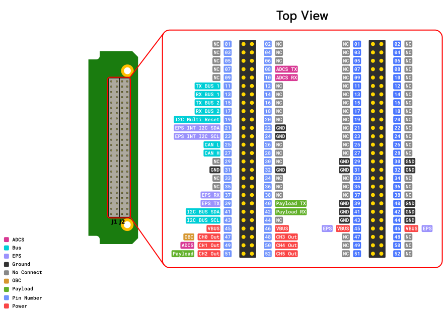

# EPS Board Command Protocol – Guide

## What is This?

This **EPS (Electrical Power System)** board is designed to manage solar power for a system. It connects **solar panels**, **sensors**, a **battery**, and **output channels** – all monitored and controlled using a simple communication protocol based on **KISS (Keep It Simple, Stupid)**.

You send commands and receive data using specific formats (frames), and these commands let you:

* Read voltages and currents from solar panels and battery
* Monitor output channels
* Turn outputs ON or OFF
<!-- * Measure battery temperature -->

---

## System Overview

| Component                | Description                                                                           |
| ------------------------ | ------------------------------------------------------------------------------------- |
| **Solar Panels**         | 6 panels, each monitored with a **INA226** sensor (measures voltage & current)        |
| **MPPT Charger**         | Takes solar power and charges the battery efficiently                                 |
| **Battery**              | Charging/discharging current measured by **INA226** sensors                           |
| **Output Channels**      | 6 output channels with safety protections (over-voltage, over-current, short-circuit) |
| **Protocol Used**        | Based on **KISS protocol** with Start/End flags and command bytes                     |
| **Battery Temp Sensors** | Monitors battery temperature                                                          |

---

## Communication Frame Format

Every command you send follows this pattern:

```
[FSTART] [CMD] [PARAM] [FEND]
```

| Field      | Description                               | Value                   |
| ---------- | ----------------------------------------- | ----------------------- |
| **FSTART** | Frame Start Flag                          | `0xC0 0x00`             |
| **CMD**    | Command (What you want to do)             | See command table below |
| **PARAM**  | Extra info (like channel number or state) | Depends on command      |
| **FEND**   | Frame End Flag                            | `0xC0`                  |

---

## Commands Summary

| Command Name       | CMD Value | PARAM                        | Description                                                |
| ------------------ | --------- | ---------------------------- | ---------------------------------------------------------- |
| `EPS_CMD_NONE`     | `0x00`    | -                            | Do nothing (reserved)                                      |
| `EPS_GET_INA226`   | `0x01`    | Channel (0–7)                | Read voltage/current from INA226 sensor (Solar or Battery) |
| `EPS_GET_ADM1177`  | `0x02`    | Channel (0–5)                | Read voltage/current from output channel                   |
| `EPS_GET_OUTPUT`   | `0x03`    | Channel (0–5)                | Get ON/OFF state of output channel                         |
| `EPS_GET_TEMP_BAT` | `0x04`    | Channel (0-1)                | Read battery temperature sensors                           |
| `EPS_SET_OUTPUT`   | `0x05`    | Channel, State (0=OFF, 1=ON) | Turn output channel ON or OFF                              |
| `EPS_SENSOR_INIT`  | `0xFE`    | -                            | Re-initialize all sensors                                  |
| `EPS_GET_PARAM`    | `0xFF`    | -                            | Get configuration parameters                               |

---

## Example Commands

| Action                            | Full Command Frame  |
| --------------------------------- | ------------------- |
| **Read Solar Panel CH1 (INA226)** | `C0 00 01 00 C0`    |
| **Turn ON Output Channel 2**      | `C0 00 05 02 01 C0` |
| **Read Battery Temp**             | `C0 00 04 00 C0`    |

---

## Tips

* All commands **must start with `0xC0 0x00`** and end with **`0xC0`**
* Always double-check **channel numbers** when sending commands
* You can use a **serial terminal** or script to send frames

## Block diagram

